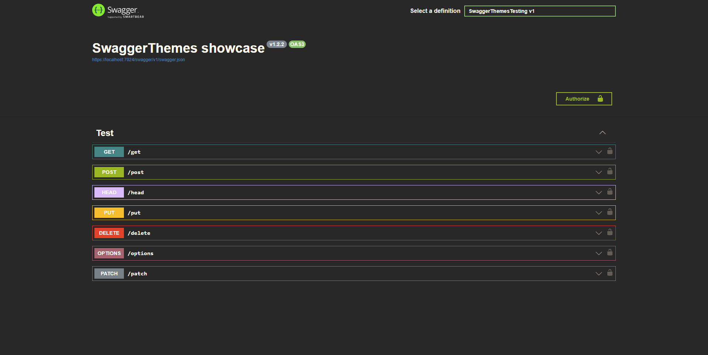
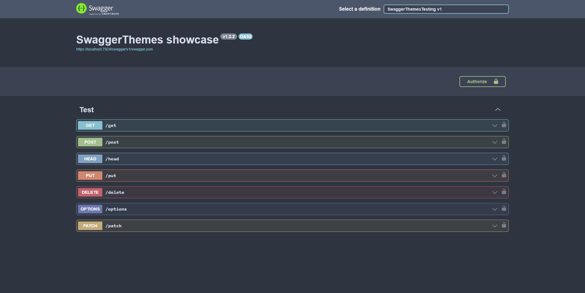

<h1>
    
    Swagger themes
</h1>

[]()
[]()

Change Swagger documentation theme easily.

## 💾 Install
With NuGet CLI:
```
nuget install oqo0.SwaggerThemes
```
Using NuGet Package Manager:
https://www.nuget.org/packages/oqo0.SwaggerThemes/

## 📚 Usage
Select any theme from [themes list](#themes) and apply it using following ways:
#### 📖 Using with Swashbuckle
```csharp
app.UseSwagger();
app.UseSwaggerThemes(Theme.UniversalDark);
app.UseSwaggerUI();
```

> [!IMPORTANT] 
> Don't use `UseSwaggerUI()` before `UseSwaggerThemes()` or themes are not going to get installed.

#### 📖 Using with NSwag
```csharp
app.UseOpenApi();
app.UseSwaggerUi(options =>
{
    options.CustomInlineStyles = SwaggerTheme.GetSwaggerThemeCss(Theme.UniversalDark);
});
```

#### 🔧 Adding custom CSS
```csharp
string customCss = "body {" +
                   "    background-color: red;" +
                   "}";

app.UseSwaggerThemes(Theme.UniversalDark, customCss );
```

## 🎨 Themes

<table>

<tr>
<td>

<h3>Dracula</h3>
  
```csharp
Theme.Dracula
```

</td>

<td>

<h3>Gruvbox</h3>
  
```csharp
Theme.Gruvbox
```

</td>
</tr>

<tr>
<td>

<h3>Monokai</h3>
  
```csharp
Theme.Monokai
```

</td>

<td>

<h3>Nord Dark</h3>
  
```csharp
Theme.NordDark
```

</td>
</tr>

<tr>
<td>

<h3>One Dark</h3>
  
```csharp
Theme.OneDark
```

</td>

<td>

<h3>Universal Dark</h3>
  
```csharp
Theme.UniversalDark
```

</td>
</tr>

<tr>
<td>

<h3>X-Code Light</h3>
  
```csharp
Theme.XCodeLight
```

</td>

</tr>

</table>

## 💡 Creating your own themes

1. Create theme `.css` in `Themes` directory.
2. Add a placeholder for filename in `Theme.cs`:
```csharp
public static Theme YourTheme => new("your-theme.css");
```
3. Add an embedded resource for your `.css` file:
```xml
    ...
    <EmbeddedResource Include="Themes\your-theme.css" />
</ItemGroup>
```
4. Use any other complete theme as a template.
5. Build project:  
```
dotnet build --configuration Release
```
